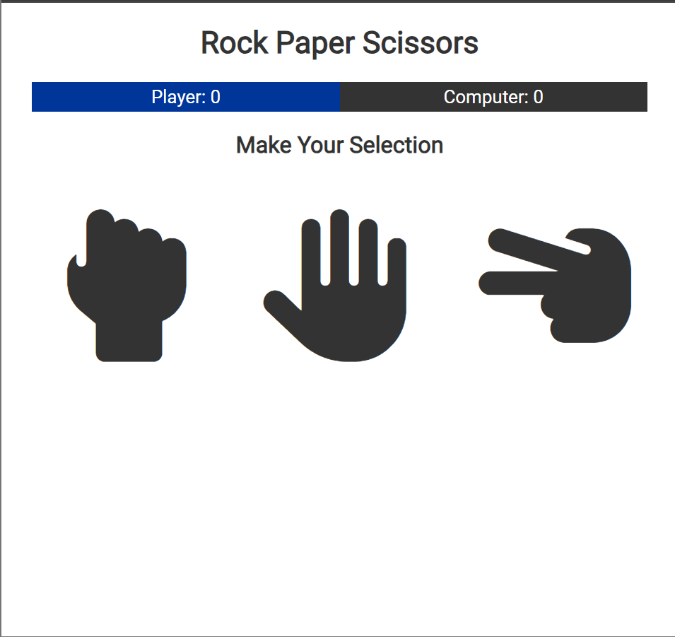
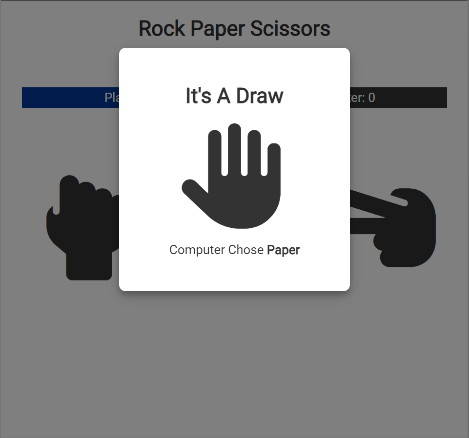

# Rock Paper Scissors Game

Welcome to the Rock Paper Scissors game project! This game allows you to play the classic Rock Paper Scissors against the computer.

## Overview

This project is a simple implementation of the Rock Paper Scissors game using HTML, CSS for styling, and JavaScript for game logic and interactivity.

## Features

- Play against the computer with random choices (rock, paper, or scissors).
- Display game outcomes (win, lose, or draw).
- Keep track of scores for both player and computer.
- Restart the game to play again.

## Technologies Used

- **HTML5:** Structure of the webpage.
- **CSS3:** Styling, including animations and layout.
- **JavaScript:** Game logic and interactivity.

## How to Play

1. Choose your move by clicking on the buttons for Rock, Paper, or Scissors.
2. The computer will randomly select its move.
3. See the game outcome displayed on the screen.
4. Keep playing until you decide to restart the game.
